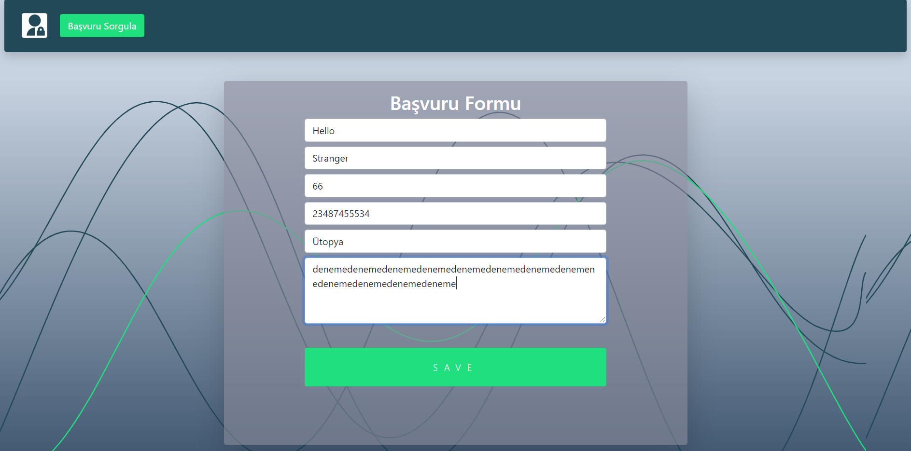
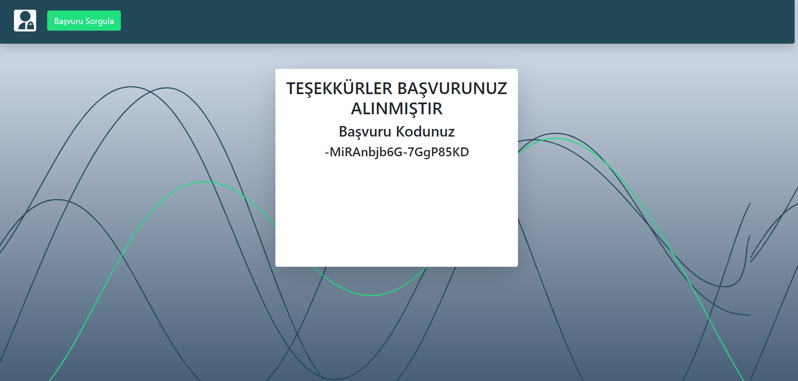
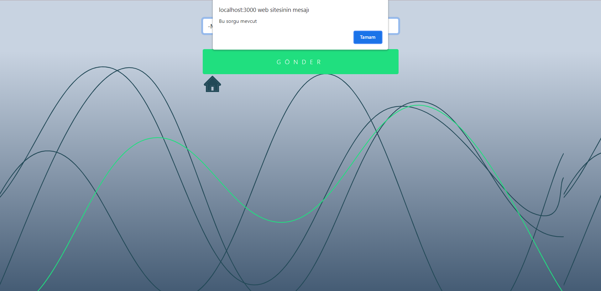
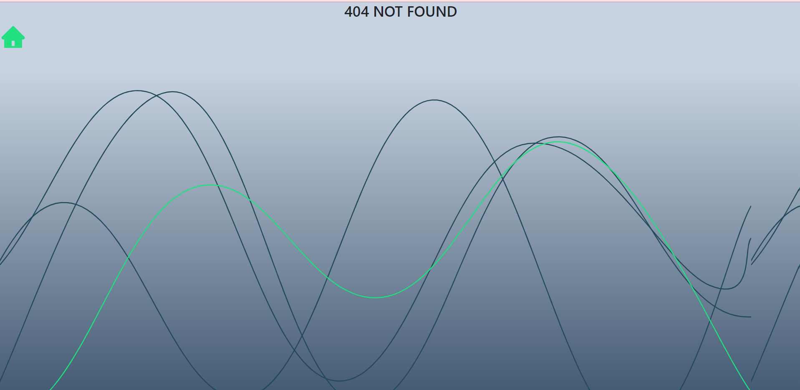
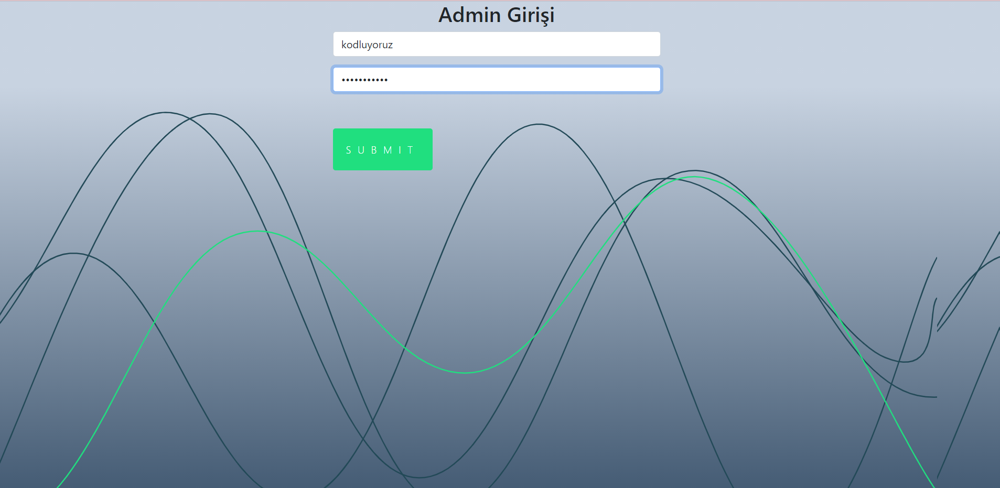
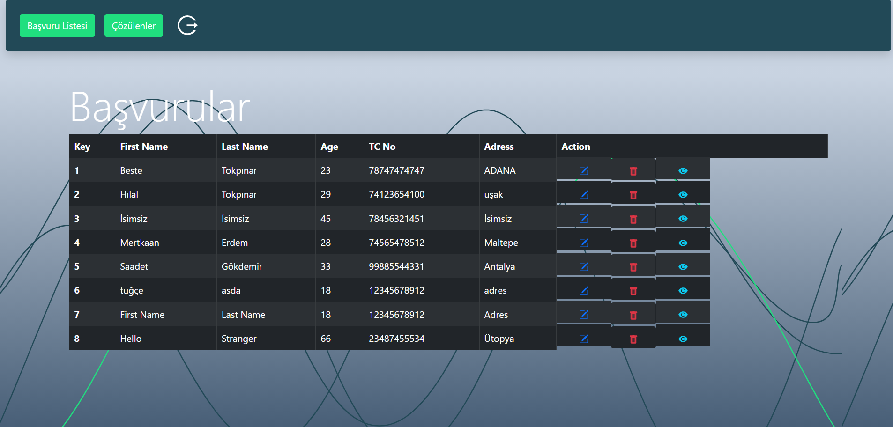
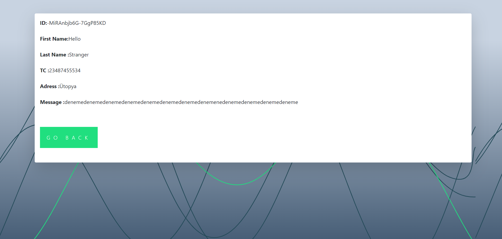
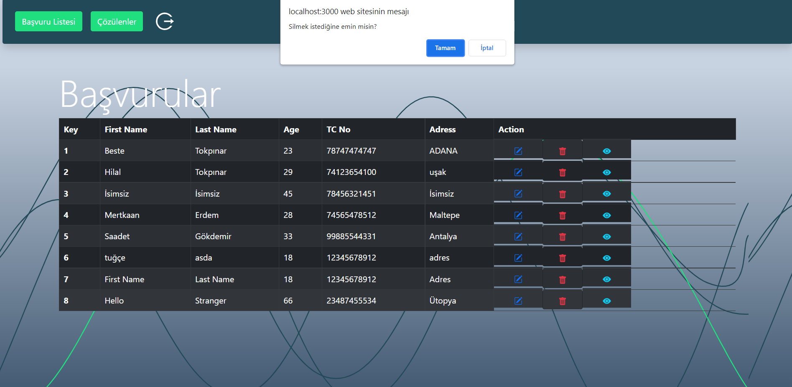
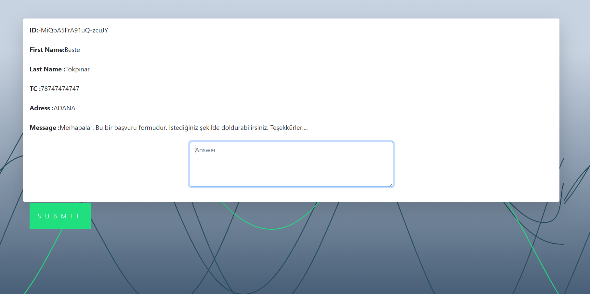
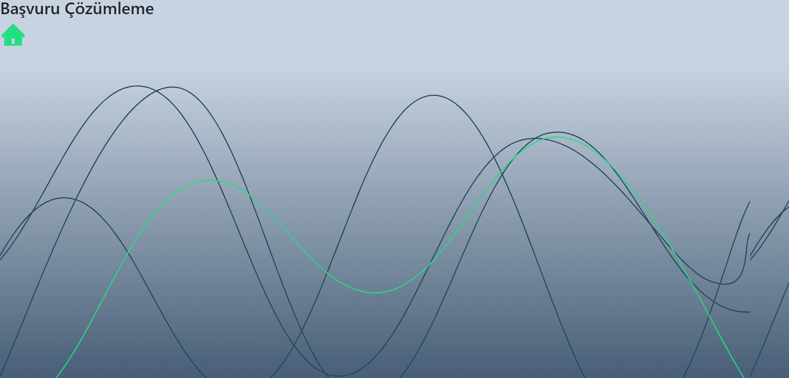

<a href= "https://optimistic-volhard-df5872.netlify.app"> Website</a>

<ul style="list-style-type:disc">
   <li>Username: kodluyoruz</li>
   <li>Password: bootcamp109</li>
</ul>

### Görseller

### Kullanılan Teknolojiler

<ul style="list-style-type:disc">
   <li><a href="https://reactrouter.com/web/guides/quick-start">React Router</a></li>
   <li><a href="https://firebase.google.com/">Firebase </a></li>
   <li><a href="https://react-hook-form.com/">React Hook Form </a></li>
   <li><a href="https://github.com/jquense/yup">Yup</a></li>
   <li><a href="https://usehooks.com/">React Custom Hooks</a></li>
   <li><a href="https://react-bootstrap.github.io/">React-Bootstrap</a></li>

</ul>

# Gereklilikler

- [x] React hooks
- [x] Router (react-router/ reach router / etc)
- [-] Context API
- [x] Form management library (react-hook-form(önerilen) / formik / etc)
- [x] Validation library (yup(önerilen), joi, etc)
- [-] Tests (Unit test zorunlu, e2e opsiyonel)
- [x] Uygulamanız kesinlikle bir servise deploy edilmiş olacak ve public link readme içinde yer alacak (netlify, vercel gibi)
- [-] Open source
- [-] Eslint

# Dikkat edelim
- [!] Tüm formlarda gerekli validasyonlar olsun.
- [!] Back-end yazmak zorunda degilsiniz, back-end olarak firebase ya da mock bir api kullanabilirsiniz.
- [!] Elinizden gelen en iyi şekilde seperation of concerns'e dikkat ederek yazın.
- [!] Admin paneline u:kodluyoruz, p:bootcamp109 bilgileri ile giriş yapabilmeliyim.
- [!] Mümkünse admin paneline bir menü ekleyelim (başvuru listesi, çıkıs gibi işlemleri kapsasın)

# Bonus (Zorunlu degil, deneysel ozellikler)
- [-] Typescript 
- [-] Service worker ile offline render destegi
- [-] Mobil uyumlulu guzel bir tasarim
- [x] Kullanilabilir UX

## Başvuru / ticket yönetim sistemi

### Genel Açıklama

Uygulamamız herkese açık bir başvuru formunun son kullanıcı tarafından doldurulması ile başlıyor. 
Formu dolduran kullanıcıya başvurusunu takip edebilecegi bir kod veriliyor. Kullanıcı başvuru durumu sayfasından bu kod ile başvurusunun çözülüp çözülemedigini kontrol edebiliyor. 

Kullanıcı adı ve şifre ile girilebilen bir ekrandan da yetkili kullanıcılar gelen başvuruları görüntüleyebiliyor cevaplanmamış başvurulara cevap yazıp durumunu çözüldü / iptal edildi / bekliyor vb gibi güncelleyebiliyor. Gerekirse eski kayıtlara ulaşabiliyor.

#### Detaylı Açıklama

##### Routes / Paths

- /basvuru-olustur (default)
  - Public endpoint.
  - Başvuru formunu herhangi bir kullanıcının doldurmasına imkan verir.
  - Başvuru formunda [Ad, Soyad, Yaş, TC, Başvuru Nedeni, Adres Bilgisi, Fotograflar/Ekler, Gonder] butonu yer alır. 

- /basvuru-basarili (Basvuru formu doldurulduktan sonra gelen sayfa)
  - Ekranda bir teşekkür mesajı yer alır ve kullanıcıya başvuru detayları ile birlikte başvuru kodu verilir.

- /basvuru-sorgula
  - Ekranda başvuru kodu girilebilen bir input ve sorgula butonu vardır.

- /basvuru/{basvuruNo}
  - Ekranda başvuru varsa bilgileri, son durumu ve verilen cevap(lar) yer alır.
  - Başvuru numarası hatalıysa 404(bulunamadı) mesajı çıkar.

- /admin
  - Ekranda kullanıcı giriş formu vardır. (Rahat test edebilmemiz için u:kodluyoruz, p:bootcamp109 bilgileri ile giriş yapabilmeliyim.)

- /admin/basvuru-listesi
  - Başarıli giriş sonrası bekleyen (çözülmemiş/cevaplanmamış) başvuruların listesi yer alır ve basit bilgiler sunar. (Başvuru yapan, tarih)
  - Başvuru listesinde her elemenda başvuruyu görüntüle butonu vardır.

- /admin/basvuru/{basvuruNo}
  - Başvurunun durumu güncellenebilir ve başvuruya cevap yazılabilir.
  - Burada yazılan cevap son kullanıci tarafından basvuru/{basvuruNo} kısmından görüntülenebilmelidir.